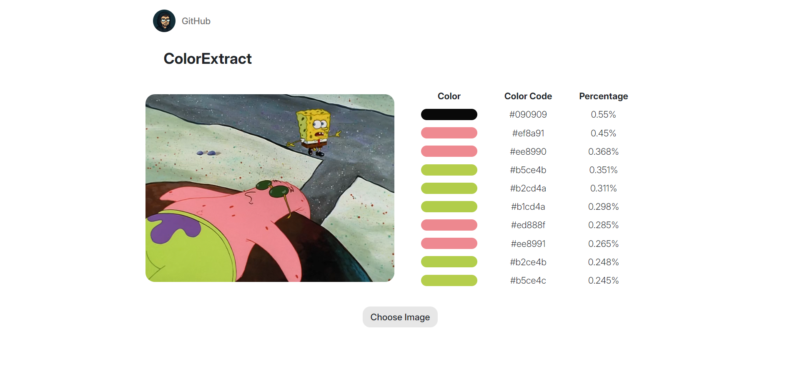

# ColorExtract
ColorExtract is a simple Flask web app that lets you upload an image and extracts the top 10 dominant colors, displaying them with their hex codes and percentages.

---

## Features

- Upload images (png, jpg, jpeg)
- Extract top 10 colors with their relative percentages
- Displays the uploaded image alongside a color table
- Simple, clean UI with Bootstrap and custom styles
- Overwrites previous upload to save space
- Cache busting for uploaded image display



## Installation

1. Clone this repo:
  ```bash
  git clone https://github.com/hesoom/colorextract.git
  cd colorextract
  ```
3. Create and activate a virtual environment (optional but recommended):
  ``` bash
  python -m venv venv
  source venv/bin/activate  # On Windows: venv\Scripts\activate
  ```
3. Install required packages:
  ``` bash
  pip install -r requirements.txt
  ```
4. Run the app:
  ``` bash
  python main.py
  ```
5. Open your browser at `http://127.0.0.1:5000`

## Usage

- Click Choose Image to select an image file
- The image will upload automatically
-  The page reloads showing the uploaded image and a table of top colors with their hex codes and percentage coverage

## Project Structure

```
colorextract/
├── main.py           # Flask app and image processing logic
├── templates/
│   └── index.html    # Main HTML template
├── static/
│   ├── style.css     # Custom CSS styles
│   └── img/          # Default and profile images
├── uploads/          # Uploaded images (overwritten each time)
├── requirements.txt  # Python dependencies
└── README.md
```
